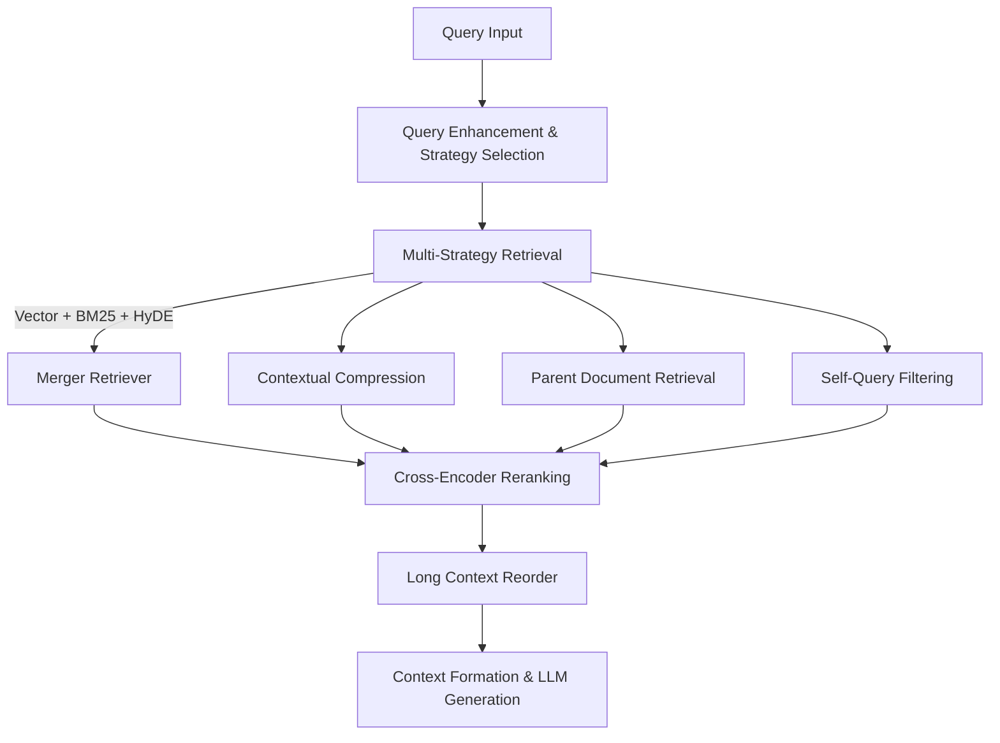

# Advanced RAG System

An robust document Q&A system built with **LangChain**, **Ollama**, and **Streamlit** featuring advanced retrieval techniques including merger retrieval, contextual compression, parent document retrieval, and HyDE.

## Key Features

### Advanced Retrieval Techniques

- **Merger Retriever**: Combines multiple retrieval methods for comprehensive results
- **Long Context Reorder**: Handles the "Lost in Middle Phenomenon" for better context utilization
- **Contextual Compression Retriever**: Compresses retrieved content while preserving relevance
- **Self Querying Retriever**: Interprets user queries to determine appropriate metadata filters
- **Parent Document Retriever**: Retrieves larger parent documents based on relevant chunks
- **HyDE (Hypothetical Document Embeddings)**: Uses generated hypothetical documents for better matching
- **Cross-Encoder Reranking**: Neural reranking for improved relevance scoring

### Smart Query Processing

- **Automatic Strategy Selection**: Chooses optimal retrieval strategy based on query type
- **Query Enhancement**: Expands queries with relevant context and synonyms
- **Multi-level Chunking**: Different chunk sizes for different retrieval strategies

### Smart Document Processing

- **Multi-format Support**: PDF, TXT, CSV files
- **Intelligent Chunking**: Recursive text splitting with overlap
- **Metadata Preservation**: Source tracking and page numbers

### User-Friendly Interface

- **Streamlit Web UI**: Clean interface
- **Strategy Selection**: Manual or automatic retrieval strategy selection
- **Real-time Processing**: Live document processing and query handling
- **Source Attribution**: Proper citation tracking with expandable source views

## Quick Start

### 1. Prerequisites

Go to Ollama website and download the Windows installer:
https://ollama.ai/download

Open Command Prompt or PowerShell and run:
ollama serve

### 2. Setup Project

# Clone or download the project files

# Create virtual environment (recommended)

python -m venv venv
source venv\Scripts\activate

# Install dependencies

pip install -r requirements.txt

### 3. Configure Environment

Create a `.env` file in the project root:

env

# Ollama Configuration

OLLAMA_BASE_URL=http://localhost:11434
OLLAMA_MODEL=gemma3:1b
OLLAMA_EMBEDDING_MODEL=mxbai-embed-large:latest

# Document Processing

CHUNK_SIZE=500
CHUNK_OVERLAP=50

# Retrieval Configuration

RETRIEVER_K=8
COMPRESSION_RETRIEVER_K=10
HYDE_RETRIEVER_K=8
BM25_RETRIEVER_K=8
RERANK_TOP_K=5
FINAL_DOCS_COUNT=6

# Model Configuration

LLM_TEMPERATURE=0.1
CROSS_ENCODER_MODEL=cross-encoder/ms-marco-MiniLM-L-6-v2

### 4. Pull Required Models

# Essential models for the RAG system

ollama pull gemma3:1b # Main language model
ollama pull mxbai-embed-large:latest # Embedding model

### 5. Verify Setup

# Check Ollama is running

http://localhost:11434

# Verify models are installed

ollama list

### 5. Run the Application

# Activate virtual environment (if using)

source venv\Scripts\activate

# Start the application

streamlit run app.py

## How to Use

### 1 Upload Documents

- Use the sidebar to upload **PDF, TXT, or CSV** files
- Click **Process Documents** to index them
- Wait for confirmation message

### 2 Ask Questions

- Type questions in the chat interface
- Get answers with **inline citations** \[1], \[2]
- View **source documents** at the bottom

### 3 Example Queries

- **Factual** → _"What is the main topic of document 1?"_
- **How-to** → _"How to implement the solution mentioned?"_
- **Comparison** → _"Compare the approaches in different documents"_
- **Analysis** → _"Summarize the key findings"_

---

## Architecture

### Advanced Retrieval Pipeline



### Retrieval Strategies

- **Factual Queries** → Contextual Compression (precise answers)
- **Procedural Questions** → Parent Document Retrieval (comprehensive context)
- **Comparison Tasks** → Merger Retriever (diverse perspectives)
- **Analytical Queries** → HyDE (conceptual matching)
- **General Questions** → Auto-selection of best strategy

---

## Components

- **LangChain** → Document processing & chain orchestration
- **Ollama** → Local LLM inference (`gemma3:1b`) with connection validation
- **ChromaDB** → Dual vector databases for different chunk sizes
- **BM25** → Keyword-based retrieval
- **Cross-Encoder** → Neural reranking model
- **Streamlit** → Professional web interface
- **Modular Architecture** → Easy to extend & maintain

---

## Configuration Options

### Model Settings

- `OLLAMA_MODEL`: Main language model _(default: gemma3:1b)_
- `OLLAMA_EMBEDDING_MODEL`: Embedding model _(default: mxbai-embed-large\:latest)_
- `OLLAMA_BASE_URL`: Ollama server URL

### Retrieval Settings

- `CHUNK_SIZE`: Document chunk size _(default: 500)_
- `CHUNK_OVERLAP`: Overlap between chunks _(default: 50)_
- `RETRIEVER_K`: Number of documents to retrieve _(default: 8)_

---

## Troubleshooting

### Missing Dependencies

```bash
venv\Scripts\activate

pip install --upgrade -r requirements.txt
```

### Memory Issues

- Reduce `CHUNK_SIZE` in `.env`
- Use smaller models:

  ```bash
  ollama pull gemma3:1b
  ```

---

## Project Structure

```bash
rag-chatbot/
├── app.py
├── chatbot.py
├── config.py
├── models.py
├── document_processor.py
├── retrieval_engine.py
├── retrievers.py
├── utils.py
├── requirements.txt
├── .gitignore
├── README.md
├── chroma_db_small/
├── chroma_db_parent/
```

---

## Module Description

- **`app.py`** → Streamlit UI
- **`chatbot.py`** → Main orchestrator
- **`config.py`** → Centralized config
- **`models.py`** → LLMs, embeddings, and rerankers
- **`document_processor.py`** → Document loaders & chunking
- **`retrieval_engine.py`** → Retrieval + ranking logic
- **`retrievers.py`** → Custom retrievers (HyDE, etc.)
- **`utils.py`** → Query/document utilities

---

## Contributing

1. Fork the repo
2. Create a feature branch
3. Make your changes
4. Test thoroughly
5. Submit a pull request

---

## Support

For help:

1. Check the **Troubleshooting** section
2. Review **Ollama documentation**
3. Review **LangChain documentation**
4. Open an **issue** in this repository
